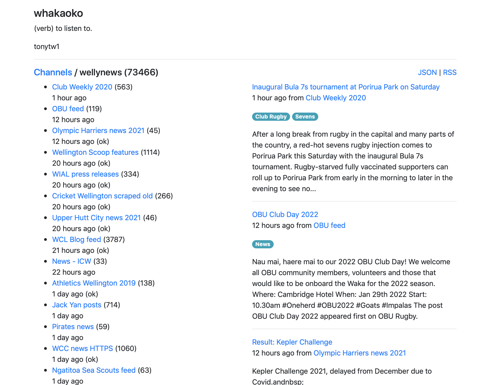
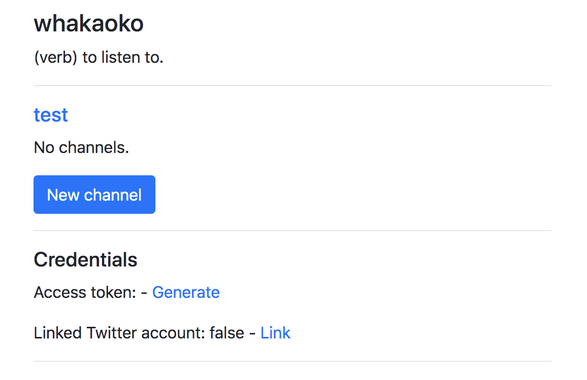
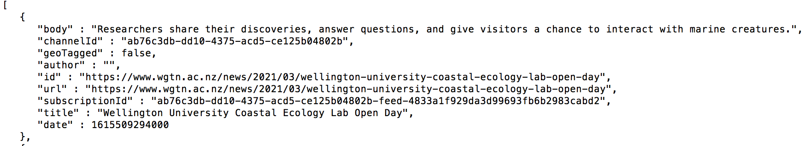

# Whakaoko (verb. to listen)

A service for aggregating 3rd party content from RSS feeds into an easy to consume local JSON or RSS feed.

Provides a [local API](src/main/resources/static/openapi.json) for other applications to consume 
the aggregated content via a single HTTP/JSON interface.





## Good at

Very good at the use case of aggregating a list of related RSS feeds into a combined channel.


## Features

### Resolving short URLs

Expands feedburner and tinyurl URLs into canonical full URLs.


### Minimises HTTP traffic

Uses etag and last modified header conditional GETs to minimise traffic.

The feedcache documentation on [implementing conditional HTTP GET](https://feedcache.readthedocs.io/en/latest/howto/index.html#implementing-conditional-http-get) describes the technique well.

### GeoRSS aware

Preserves GeoRSS location data.

## Implementation

Kotlin application. 
MongoDB 3.6 is used for storage. 
Memcached for caching of resolved short URLs.


## Concepts

### Subscriptions

A subscription represents a source of 3rd party content.
The following sources are currently supported.

- RSS / ATOM feeds

Content, media RSS and geoRSS tags.


### Channels

A channel is a collection of related subscriptions.
The content from each subscription in the channel is aggregated together.


### Output formats

Content is output is either JSON or RSS.

The RSS format encodes images as media RSS tags and geotags as geoRSS tags.


### API end points

##### GET /{userid}/channels

Lists the channels defined for this user.


#### GET /{userid}/channels/{channelid}

Details for a specific channel.


#### GET /{userid}/channels/{channelid}/subscriptions

Lists the subscriptions into this channel.


#### GET /{userid}/channels/{channelid}/items

| Parameter	 | 	Description      |
|------------|-------------------|
| format     | json / rss        |
| page       | pagination number |
	
Show content for this channel.

Contains all content items received from all of the subscriptions in this channel.


#### GET //subscriptions/{subscriptionid}

Details for a specific subscription.

```
{
  "id": "wellynews-feed-78885da5bcdcde79d46c2cb5c6d936d0",
  "name": "Coming Events – Friends of Te Papa",
  "url": "https://www.friendsoftepapa.org.nz/events/feed/",
  "channelId": "wellynews",
  "username": "tonytw1",
  "classifications": [
    "ok"
  ],
  "lastRead": "2023-06-04T15:12:10Z",
  "latestItemDate": "2023-10-09T22:00:00Z",
  "etag": "W/\"da7aa1ec5b7aaf30fe2dce55c58a44fb\"",
  "httpStatus": 200,
  "itemCount": 64,
  "lastModified": 1685671239000
}
```

| Field          | Description                                                                                                                                                                                           |
|----------------|-------------------------------------------------------------------------------------------------------------------------------------------------------------------------------------------------------|
| lastRead       | When this subscription was last read                                                                                                                                                                  |
| latestItemDate | The date of the latest item seen in the feeds response. <br/>This may be different from the date of the most recently persisted feed item if content on a given GUID has been updated or republished. |

#### GET /{userid}/subscriptions/{subscriptionid}/items

| Parameter	 | 	Description      |
|------------|-------------------|
| format     | json / rss        |
| page       | pagination number |

Show content from this subscription.


#### POST /{username}/subscriptions/feeds

| Parameter	 | 	Description                               |
|------------|--------------------------------------------|
| channel    | The channel id to add this subscription to |
| url        | The url of an RSS or ATOM feed             |
	
Request a new subscription to a RSS or ATOM feed url.


# Setup

## Run locally

Start Mongo and Memcached dependencies as Docker images:

```
docker-compose -f docker/docker-compose.yml up
```

Run using the Spring Boot plugin:

```
mvn spring-boot:run
```

The service will be visible on localhost port 8080.


## Create a user

Using the user interface:
```
http://localhost:8080/ui/newuser
```

or curl:
```
curl -XPOST http://localhost:8080/users?username=new-user
```

## Generate an access token

Using the user interface sign in as your new user.

```
http://localhost:8080/ui
```

Then click Generate to generate an access token.




## Create a channel

Either using the UI or with an API call.

```
curl -X POST http://localhost:8080/channels -H "Authorization: Bearer YOUR_TOKEN" -H "Content-Type: application/json" -d "{\"name\":\"A channel\"}"
```

Note the returned channel id. You will use it in the next request.


## Create a feed subscription

Either using the UI or with an API call.

```
curl -X POST http://localhost:8080/subscriptions -H "Authorization: Bearer YOUR_TOKEN" -H  "Content-Type: application/json" -d "{\"channel\":\"YOUR_CHANNEL_ID\",\"url\":\"http://www.victoria.ac.nz/home/about/newspubs/news/newslatest/news-rss-feed\"}"
\",\"url\":\"http://www.victoria.ac.nz/home/about/newspubs/news/newslatest/news-rss-feed\"}"
```

Note the returned subscription id. You will use it in the next request

## Read feed items

```
curl http://localhost:8080/subscriptions/YOUR_SUBSCRIPTION_ID/items | json_pp
```




# Local development

Maven build.

```
docker-compose -f docker/docker-compose.yml up
mvn clean install
```


## Cloud build

```
gcloud components install cloud-build-local
cloud-build-local --config=cloudbuild.yaml --dryrun=false --push=false .
```
